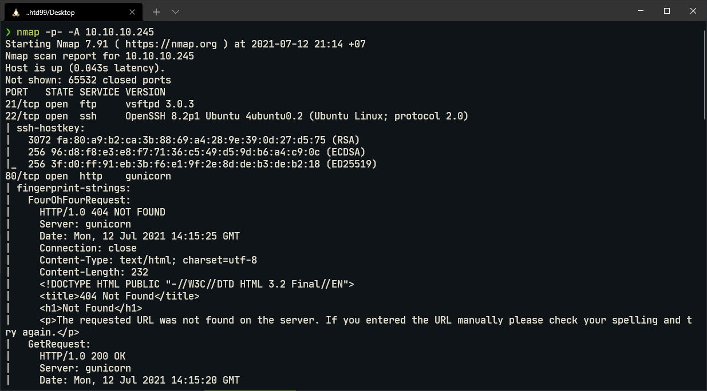
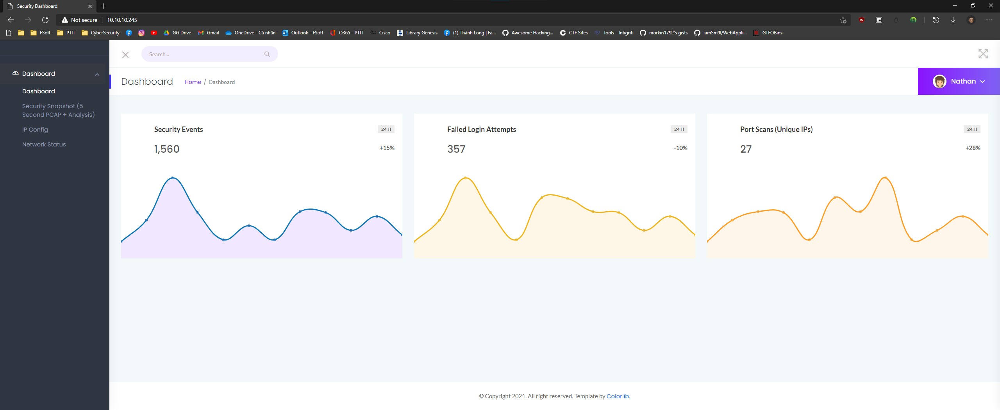
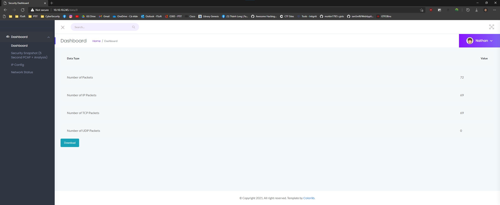
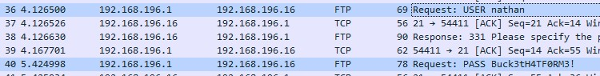
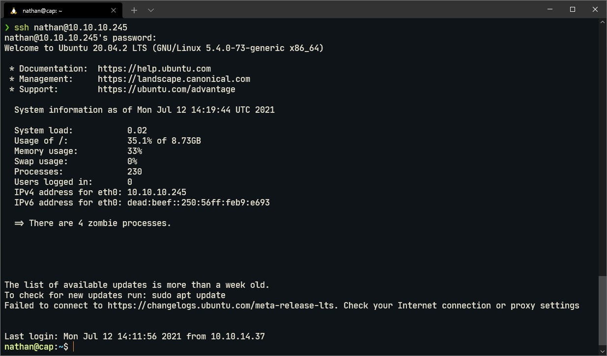
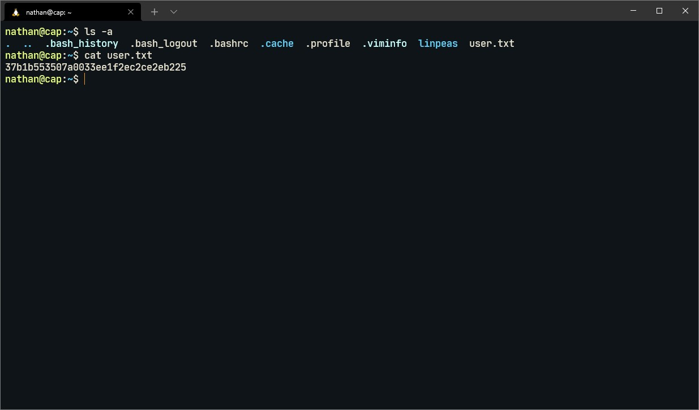
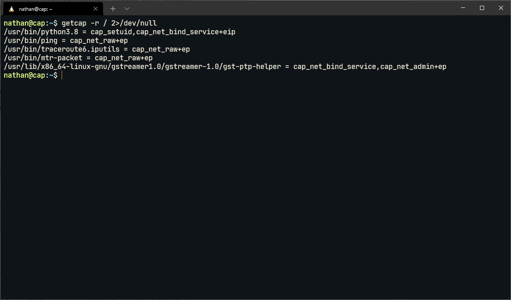
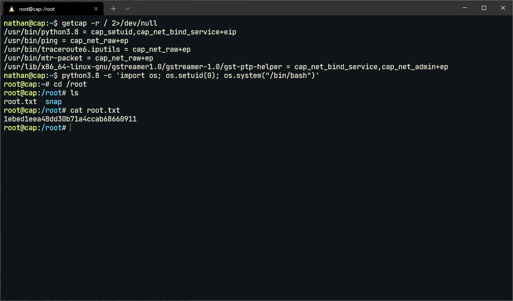

# Write-up Machine "Cap" - Easy - HTB

## Bước 1: Enumeration

Đầu tiên, em sử dụng nmap để quét mục tiêu: `nmap -p- -A 10.10.10.245`

Máy mục tiêu chạy web service tại cổng 80:

Phía bên sidebar có 3 mục là `Security Snapshot (...)`, `IP Config` và `Network Status`. Trong đó mục `Security Snapshot (...)` chuyển hướng đến `10.10.10.245/data/x`, mỗi lần thay một giá trị `x` khác nhau thì trang này lại hiển thị số gói tin khác nhau, với `x = 0` thì số gói tin là nhiều nhất:

Sau đó chọn `Download` để tải file pcap về, mở file pcap vừa tải và kiểm tra, trong file này có 2 packet chứa username và password đc trao đổi bằng giao thức FTP. Username = nathan; Password: Buck3tH4TF0RM3!

## Bước 2: Lấy user flag

Trở lại kết quả nmap ở bước 1, mục tiêu có mở dịch vụ SSH, vì thế nên em sẽ sử dụng cred tìm được ở trên để ssh vào với user `nathan`

Sau khi truy cập thành công với user là `nathan` thì tại thư mục gốc có file `user.txt`, đọc file này ta được flag user

## Bước 3: Lấy system flag

Có lẽ tên bài này cũng là gợi ý cách lấy được system flag - "Cap"abilites, kiểm tra capabilities của mục tiêu bằng lệnh `getcap -r / 2>/dev/null` em thấy python3.8 được cấp cho cap setUID.

Sử dụng python3.8 để tạo shell với UID = 0 (root) bằng lệnh: `python3.8 -c 'import os; os.setuid(0); os.system("/bin/bash")'`, sau khi đạt được root shell thì em lấy được system flag

