# The Web Application Hacker's Handbook - Second Edition - Report

Dưới đây là báo cáo tổng kết những điều em học được sau khi đọc cuốn "The Web Application Hacker's Handbook - 2nd Edition".

**Chương 1 - 2 - 3** giới thiệu tổng quan về các ứng dụng web, công nghệ chúng sử dụng và các vấn đề bảo mật mà chúng gặp phải. Nguyên nhân chính gây ra những lỗ hổng này là do người dùng có thể submit nội dung tùy ý, bao gồm cả nội dung bình thường và các nội dung độc hại. Do đó các ứng dụng web đều phải sử dụng cơ chế phòng thủ, cơ chế này gồm 4 yếu tố cốt lõi là **Handling user access**, **Handling user input**, **Handling Attackers** và **Managing the Application**.

1. Handling user access: Kiểm soát quyền truy cập của người dùng tới dữ liệu và chức năng của ứng dụng, sử dụng 3 cơ chế chính:

    - Authentication: Xác thực
    - Session management: Quản lý phiên
    - Access Control: Quản lý quyền truy cập

2. Handling user input: Kiểm soát đầu vào của người dùng để tránh các đầu vào độc hại gây ảnh hưởng đến web app

    - Approach to Input Handling:
        - "Reject Known Bad": Kiểm tra trong black-list
        - "Accept Known Good": Kiểm tra trong white-list
        - Santitization: Các kí tự nguy hiểm trong input sẽ được encoded hoặc escaped trước khi xử lý. Ví dụ HTML tag được escaped thành `&lt;` hoặc `&gt;`
        - Safe Data Handling: Sử dụng các phương pháp lập trình an toàn để tránh lỗ hổng. Ví dụ SQLi ....
        - Semantic Checks
    - Boundary Validationg: Mỗi đơn vị chức năng riêng biệt phía server-side sẽ tự kiểm duyệt input của mình
    - Multistep Validation and Canonicalization: Canonicalization là quá trình convert kí tự thành kí tự thông thường, quá trình Canonicalization và Validation sẽ diễn ra liên tiếp.

3. Handling Attackers: Khi bị tấn công thì ứng dụng sẽ đưa ra những biện pháp phỏng thủ và phản công như nào để ngăn cản tin tặc

    - Handling errors: Xử lý các `unexpected errors` kĩ lưỡng và thông báo tới người dùng, tránh trả về thông điệp hệ thống hoặc thông tin debug.
    - Maintaining audit logs: Logs dùng để phát hiện và điều tra các xâm nhập trái phép vào ứng dụng. Audit Logs hiệu quả thường ghi lại thời gian mỗi sự kiện, địa chỉ IP của request và tài khoản người dùng (nếu đã đăng nhập)
    - Alerting Administrators: Các cơ chế cảnh báo cho admin phải chính xác, tin cậy và không tạo quá nhiều cảnh báo khiến chúng có thể bị bỏ qua
    - Reacting to attacks: Cách ứng dụng phản ứng với cuộc tấn công

4. Managing the Application: Cho phép quản trị viên giám sát hoạt động của ứng dụng.

**Chương 4: Mapping the application** giới thiệu các kĩ thuật enumerate ứng dụng web, liệt kê toàn bộ đường dẫn, tệp tin hay chức năng của ứng dụng web. Chương này chủ yếu hướng dẫn sử dụng Web Spider và một số kĩ thuật khác như brute force để enumerate toàn bộ ứng dụng web. Sau đó thực hiện phân tích ứng dụng.

Khía cạnh chính cần điều tra:

- Chức năng chính của ứng dụng
- Off-site links, thông báo lỗi, admin/logging function, use of redirects
- Các cơ chế bảo mật như quản lý phiên, quản lý truy cập, cơ chế xác thực, supporting logic (đăng ký, thay đổi mật khẩu, khôi phục tài khoản)
- Toàn bộ vị trí có thể nhận input từ phía người dùng
- Công nghệ, nền tảng mà phía client-side và server-side sử dụng.

Core Methodology

- Mannual browsing and user-directed spidering to enumerate the application’s visible content and functionality
- Use of  brute force combined with human inference and intuition to discover as much hidden content as possible
- An intelligent analysis of the application to identify its key functionality, behavior, security mechanisms, and technologies
- An assessment of the application’s attack surface, highlighting the most promising functions and behavior for more focused probing into exploitable vulnerabilities

**Chương 5: Bypassing Client-Side Controls** giới thiệu các kĩ thuật vượt qua điều khiển khiển truy cập phía client-side. Dữ liệu được transmit từ client lên server theo nhiều cách như Hidden Form Fields, HTTP Cookies, URL Parameters, `Referer` Header, Opaque Data hay `ViewState` trong ASP.NET. Với các kiểu transmit dữ liệu như HTML Forms hay qua Browser Extensions, devs đều có thể áp dụng các cơ chế kiểm duyệt input như mã hóa, giới hạn đầu vào, ... nhưng đều có thể bị bypass bởi người dùng hoàn toàn kiểm soát nội dung gửi lên. Cách phổ biến nhất là sử dụng proxy như Burp Proxy để chặn bắt và sửa đổi các gói tin gửi dữ liệu lên server.

Để xử lý dữ liệu phía clien-side an toàn:

- Transmitting Data Via Client
    - Nếu devs cần gửi dữ liệu từ client thì phải signed hoặc mã hóa để tránh dữ liệu bị giả mạo
    - Tuy nhiên, việc signed/mã hóa có 2 vấn đề:
        - Một số dữ liệu có thể bị giả mạo bằng kĩ thuật replay attack
        - Nếu biết bản rõ và bản mã -> có thể tìm được hệ mật để tấn công
- Validating Client-Generated Data
    - Dữ liệU từ phía người dùng luôn có thể là độc hại
    - Cách an toàn nhất là kiểm duyệt mọi dữ liệu phía server-side
- Logging and Alerting
    - Các hoạt động khả nghi phải được ghi lại
    - Các cảnh báo nên dược đưa ra trong thời gian thực
    - Nếu phát hiện người dùng thực hiện các hành vi nguy hiểm thì phải ngắt phiên hoạt động của họ ngay

**Chương 6: Attacking Authenticaion** giới thiệu các kĩ thuật tấn công vào khâu xác thực người dùng. Có nhiều công nghệ xác thực người dùng như HTML form-based authentication, Multifactor mechanisms, HTTP Basic and digest authentication, ... tuy nhiên vẫn tồn tại một số lỗ hổng trên các web app như:

- Cho phép sử dụng mật khẩu yếu
    - Mật khẩu ngắn
    - Sử dụng các cụm từ phổ biến
    - Mật khẩu giống với username
    - Sử dụng mật khẩu mặc định
- Cơ chế login có thể bị brute-force do không giới hạn số lần nhập
- Thông điệp xác thực lỗi cung cấp thông tin rằng username không hợp lệ hay password không hợp lệ
- Một số web app sử dụng HTTP có thể bị nghe trộm
- Chức năng đổi mật khẩu:
    - Không giới hạn số lần đoán "existing password"
    - Chỉ kiểm tra 2 trường "new password" và "confirm new password" sau khi đã kiểm tra trường "old password" có đúng hay không
- Chức năng quên mật khẩu:
    - Nếu bị khai thác có thể bị chiếm mất quyền điều khiển tài khoản
    - Câu hỏi bảo mật không an toàn
    - Có thể bị khai thác tính năng "hint"
- Chức năng "remember me":
    - Cookie có thể là ID và có thể bị đoán được
    - Cookie có thể bị chiếm bằng kĩ thuật XSS
- Các chức năng quản trị không được bảo vệ:
    - Chức năng quản trị ẩn nhưng không được bảo vệ
    - Có thể tin tưởng tin tường thông qua cookie
    - Có thể bị khai tahcs để leo thang đặc quyền
    - Backdoor
- Không kiểm tra kĩ lưỡng và cẩn thận credentials
- Username không phải độc nhất
- Username hoặc password có thể đoán được

Các cơ chế xác thực tồn tại những lỗ hổng kể trên có thể bị khai thác dẫn đến việc bypass được quá trình xác thực. Để bảo vệ quá trình xác thực, các web app có thể thực hiện một số biện phạm như sử dụng credentials mạnh, xử lý các credentials cẩn thận và an toàn, kiểm duyệt các credentials kĩ lưỡng, sử dụng các cơ chế bảo mật tránh rò rỉ thông tin, ngăn chặn tấn công bruteforce và việc lợi dụng các chức năng như đổi mật khẩu, ...

**Chương 7: Attacking Session Management** giới thiệu các kĩ thuật tấn công quá trình quản lý phiên. 2 lỗ hổng chính trong quá trình quản lý phiên là lỗ hổng trong khâu sinh token và lỗ hổng trong khâu quản lý token

1. Weakness in Token Generation (Điểm yếu trong khâu sinh token)
    - Token có nghĩa - token là một phần của thông tin người dùng...
    - Token dễ dàng bị đoán được
    - Token mã hóa sử dụng thuật toán yếu
    - Khắc phục:
        - Use an extremely large set of possible values
        - Contain a strong source of pseudorandomness, ensuring an even and unpredictable spread of tokens across the range of possible values
        - Examples of pseudorandom item can be ADDED to token:
            - Source IP Address and Port Number
            - The `User-Agent` header
            - The time of the request in milliseconds

2. Weakness in Session Token Handling (Điểm yếu trong khâu quản lý token)
    - Disclosure of Tokens on the Network: Bị nghe lén bằng kĩ thuật Man-in-the-Middle
    - Disclosure of Tokens in Logs: Web app tồn tại lỗ hổng LFI
    - Vulnerable Mapping of Tokens to Sessions: Lỗ hổng trong khâu ánh xạ token, token tĩnh - không bị hủy bỏ sau khi phiên kết thúc có thể bị khai thác
    - Vulnerable Session Termination: Lỗ hổng trong khâu kết thúc phiên - ví dụ như đăng xuất, ...
    - Client Exposure to Token Hijacking: Client bị chiếm token bằng kĩ thuật tấn công XSS hay CSRF, ...
    - Liberal Cookie Scope
    - Khắc phục:
        - Sử dụng HTTPS
        - Khi người dùng logout phải kết thúc toàn bộ phiên liên quan
        - Áp dụng thời gian hết hạn token
        - Sử dụng cơ chế 2FA hoặc reauth để ngăn chặn CSRF 

**Chương 8: Attacking Access Controls** giới thiệu các kĩ thuật tấn công vào khâu quản lý truy cập. Có 3 kiểu tấn công vào kiểm soát truy cập chính:

- Vertical Privilege Escalation: Leo thang đặc quyền dọc, khi người dùng có thể thực thi các chức năng quản trị
- Horizontal Privilege Escalation: Leo thang đặc quyền ngang, khi người dùng có thể xem hoặc sửa nội dung mà không được cho phép
- Business logic exploitation: Khi người dùng khai thác lỗ hổng trong ứng dụng để đạt đc quyền truy cập tới key resource

Các lỗ hổng trong khâu quản lý truy cập:

- Completely Unprotected Functionality: Các chức năng, tài nguyên nhạy cảm ko được bảo vệ, ví dụ mọi người dùng đều có thể truy cập trang `https://wahh-app.com/admin/`
- Identifier-Based Functions: ID của tài nguyên được pass thẳng vào URL, người dùng khác nếu sử dụng URL này có thể xem được tài nguyên nhạy cảm. Ví dụ: `https://wahh-app.com/ViewDocument.php?docid=1280149120`
- Multistage Functions: Quá trình kiểm tra quyền truy cập chỉ diễn ra ở 1 giai đoạn trong multistage -> có thể bị khai thác
- Static Files
- Platform Misconfiguration
- Insecure Access Control Methods
- Parameter-Based Access Control: `https://wahh-app.com/login/home.jsp?admin=true`
- Referer-Based Access Control: Chỉnh sửa `Referer` HTTP Header
- Localtion-Based Access Control: 
    - Using a web proxy that is based in the required location
    - Using a VPN that terminates in the required location
    - Using a mobile device that supports data roaming
    - Direct manipulation of client-side mechanisms for geolocation

Các khía cạnh cần kiểm tra:

- Testing with Different User Accounts
- Testing Multistage Processes
- Testing with Limited Access
- Testing Direct Access to Methods
- Testing Controls Over Static Resources
- Testing Restrictions on HTTP Methods

Bảo vệ khâu quản lý quyền truy cập

- The application server can be used to control access to entire URL paths on the basis of user roles that are defi ned at the application server tier.
- The application can employ a different database account when carrying out the actions of different users. For users who should only be querying data (not updating it), an account with read-only privileges should be used.
- Fine-grained control over access to different database tables can be implemented within the database itself, using a table of privileges.
- The operating system accounts used to run each component in the infrastructure can be restricted to the least powerful privileges that the component actually requires.

**Chương 9: Attacking Data Stores** giới thiệu các kĩ thuật tấn công vào cơ sở dữ liệu. Hiện nay, dữ liệu được lưu trữ phổ biến ở  SQL databases, XML-based repositories và LDAP directories. Do đó, có 3 kĩ thuật tấn công chịnh dựa vào 3 dạng cơ sở dữ liệu như trên

Injecting into SQL:

- SQL dùng để đọc, cập nhật, thêm, sửa và xóa dữ liệu trong CSDL
- Web App tồn tại lỗ hổng SQLi cho phép kẻ tấn công chèn câu lệnh SQL và submit lên server, câu lệnh SQL sẽ được thực thi tại CSDL
- Các câu lệnh SQL có thể bị chèn: `SELECT`, `INSERT`, `UPDATE`, `DELETE`
- SQLi Bugs:
    - Injecting into String Data
    - Injecting into Numeric Data
    - Injecting into the Query Structure
- Có thể khai thác lỗ hổng SQLi để:
    - Lấy thông tin về CSDL
    - Trích xuất dữ liệu bằng `UNION SELECT`
    - Thậm chí có thể dẫn đến RCE, drop CSDL, ...
- Một số kĩ thuật SQLi có thể kể đến như:
    - Bypassing Filters:
        - Tránh sử dụng các kí tự bị block, thay vào đó có thể sử dụng ASCII code
        - Thay vì sử dụng `SELECT` thì có thể sử dụng `SeLeCt`, `%00SELECT` hay `%53%45%4c%45%43%54`, ...
        - Sử dụng SQL comments là `/*` và `*/` để tạo khoảng trống trong payload. Ví dụ: `SELECT/*foo*/username,password/*foo*/FROM/*foo*/users` hay `SEL/*foo*/ECT username,password FR/*foo*/OM users`
    - Second-Order SQL Injection
    - Advanced Exploitation:
        - Trả về dữ liệu dạng số:
            - `ASCII()` - trả về ASCII Code
            - `SUBSTRING()` - cắt string
            - Ví dụ: `SUBSTRING(‘Admin’,1,1)` = A và `ASCII(‘A’)` = 65
            - -> `ASCII(SUBSTR(‘Admin’,1,1))` = 65
        - Sử dụng Out-of-Band Channel

Ngoài ra còn có 1 số kĩ thuật tấn công khác như

- Injecting into NoSQL - MongoDB
- Injecting into XPath
    - Subverting Application Logic
    - Informed XPath Injection
    - Blind XPath Injection
    - Finding XPath Injection Flaws
    - Preventing XPath Injection
- Injecting into LDAP
    - Exploit LDAP Injection
    - Finding LDAP Injection Flaws
    - Preventing LDAP Injection

**Chương 10: Attacking Back-End Components** giới thiệu các kĩ thuật tấn công các thành phần phía back-end - ở đây là hệ điều hành (OS - Operating System). Ngôn ngữ PHP có hàm `eval()` sẽ thực thi code được pass vào function -> có thể bị khai thác. Tương tự với các web app sử dụng dữ liệu trên URL pass thẳng vào shell đều có thể bị khai thác. Một số kí tự phổ biến trong command Injection là ` ; | & `. Lỗ hổng Path Traversal cũng tương tự như vậy. Cách để khắc phục lỗ hổng này là sử dụng các cơ chế kiểm duyệt đầu vào.

XXE (XML External Entities)

- Một số web app sử dụng XML để trao đổi dữ liệu giữa client và server, khi gặp các web app dạng này nên kiểm tra lỗ hổng XXE
- Lỗ hổng XXE xảy ra do XML hỗ trợ dùng thực thể ngoài, đây là phương pháp tham chiếu dữ liệu kể cả trong hay ngoài file XML
- Có thể custom thực thể ngoài bằng phần tử `DOCTYPE` ở đầu file XML. Ví dụ: `<!DOCTYPE foo [ <!ENTITY testref “testrefvalue” > ]>`. Ở đây, trình parser sẽ thay thế mọi `&testref` bằng `testrefvalue`
- Một thực thể XML ngoài được xác định bằng cách sử dụng từ khóa `SYSTEM`, và phần định nghĩa đằng sau có thể là URL. Ví dụ: `<!DOCTYPE foo [ <!ENTITY xxe SYSTEM “file:///windows/win.ini” > ]>   <Search><SearchTerm>&xxe;</SearchTerm></Search>`
- Dựa vào thực thể ngoài có thể khiến cho ứng dụng trả về các dữ liệu nhạy cảm, hoặc nếu không có thể dùng nó để tấn công từ chối dịch vụ bằng cách đọc file stream vô thời hạn. Ví dụ: `<!DOCTYPE foo [ <!ENTITY xxe SYSTEM “ file:///dev/random”> ]>`

**Chương 11: Attacking Application Logic** giới thiệu một số kĩ thuật tấn công logic ứng dụng

- Submit request nhưng không đầy đủ tham số (không nhập captcha hay old password, ...)
- Bắt buộc ứng dụng tiếp tục làm việc nhưng bỏ qua 1 bước nào đó.
- Submit parameters ở các trạng thái khác nhau
- Bypass filter mà các kí tự nguy hiểm bị escaped (ví dụ `/` bị escaped thì input `//`) 

**Chương 12: Attacking Users: Cross-Site Scripting** giới thiệu kĩ thuật tấn công XSS. Có 3 kiểu XSS chính là Reflected XSS, Stored XSS và DOM-Based XSS

1. Reflected XSS:

- Đây là dạng tấn công XSS phổ biến nhất, tin tặc sẽ gửi cho nạn nhân URL chứa mã JS độc hại, khi nạn nhân truy cập URL này thì đoạn JS sẽ được thực thi trên phía browser của client.
- Hình thức này thường dùng để đánh cắp cookie

2. Stored XSS:
- Tin tặc sẽ submit nội dung chứa mã JS độc hại lên server, bất cứ người dùng nào khi request nội dung mà tin tặc submit lên thì server sẽ response với mã JS độc hại đó
- Hình thức này thường dùng để đánh cắp cookie hoặc deface, ...

3. DOM-based XSS: kĩ thuật XSS dựa trên việc thay đổi cấu trúc DOM của tài liệu HTML

Khai thác lỗ hổng XSS:

- Có thể sử dụng HTML-decode để làm nhiễu payload: ``
- Bypass filter: `«img onerror=alert(1) src=a»`
- `<`
- `<scr<object>ipt>alert(1)</script>`
- Sử dụng unicode escapes ``
- Reflected XSS -> DOM-based: ``

**Chương 13: Attacking Users: Other Techniques**

**Chương 14: Automating Customized Attacks** hướng dẫn cách thiết lập một cuộc tấn công tự động bằng Burp Suite, cụ thể ở đây là Burp Intruder. Tuy nhiên không phải trong mọi tình hướng đều có thể tiến hành tự động được, trong vài trường hợp sẽ gặp cản trở như:

- Cơ chế quản lý phiên: Burp Suite hỗ trợ giải quyết cản trờ này bằng Cookie jar, Request macros, Session-handling rules.
- CAPTCHA: Cách để bypass CAPTCHA là tấn công vào cách mà CAPTCHA được gửi đến người dùng và cách ứng dụng xử lý solution của người dùng, cụ thể như sau:
    - CAPTCHA được tải qua URL có đính kèm với solution là một tham số
    - Solution được đặt trong hidden form field
    - Solution được đặt trong HTML comment hoặc chỗ nào đó cho mục đích debug
    - Có thể giải quyết CAPTCHA theo 2 cách là sử dụng máy tự động giải hoặc giải thủ công

**Chương 15: Exploiting Information Disclosure** hướng dẫn cách thu thập các thông tin mà ứng dụng làm lộ lọt thông qua nhiều cách:

- Error Messages cung cấp quá nhiều thông tin như Script Error, Stack Traces, ....
- Các thông tin công khai về ứng dụng
- Suy luận từ các thông tin có được, ...

**Chương 16: Attacking Native Compiled Applications** giới thiệu các kĩ thuật khai thác lỗi trong khâu lập trình ứng dụng như Buffer Overflow hay Format String Vulnerabilities

- Buffer Overflows:
    - Stack Overflows: Thường xảy ra với các ứng dụng sử dụng ngôn ngữ C, khi dữ liệu người dùng nhập vào vượt quá giới hạn bộ nhớ đc cấp thì sẽ xảy ra tình trạng buffer overflow
    - Heap Overflows
- Integer Overflows
- Format String: Thường xảy ra trong ngôn ngữ C, hàm `printf`, string format được xác định khi passed vào hàm.

**Chương 17 và Chương 18** giới thiệu các kĩ thuật tấn công vào cấu trúc ứng dụng và server

**Chương 19: Finding Vulnerabilities in Source Code** hướng dẫn cách phát hiện các lỗ hổng phổ biến trong source code ứng dụng.

**Chương 21: A Web Application Hacker's Methodology** 

1. Map the Application's Content

   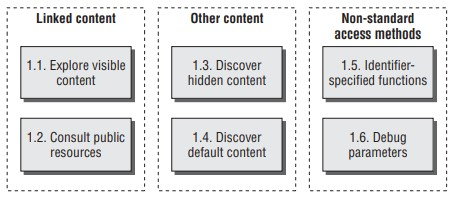

   - Explore Visible Content
     - Config trình duyệt sử dụng proxy/spidering tool như Burp hay WebScarab
     - Config trình duyệt sử dụng extension như IEWatch để theo dõi và phân tích HTTP, HTML content mà trình duyệt xử lý
     - Duyệt toàn bộ ứng dụng web thủ công, truy cập toàn bộ link và URL, submit toàn bộ form, ... Thử duyệt với JavaScript/Cookie bật/tắt
     - Nếu ứng dụng yêu cầu xác thực thì sử dụng credential đã tạo để có thể truy cập các chức năng/tài nguyên được bảo vệ
     - Giám sát các requests và responses qua proxy để hiểu rõ hơn về kiểu dữ liệu được submit và cách client dùng chúng
     - Kiểm tra site map được tạo bởi spidering để xác định xem nội dung hay chức năng nào mà người dùng chưa duyệt qua nhưng vẫn xuất hiện trong site map. Nếu có thì truy cập nội dung/chức năng đó bằng trình duyệt để spider có thể xác định thêm được các nội dung mở rộng.
     - Sau khi đã duyệt thủ công và sử dụng spider xong thì người dùng có thể sử dụng spider để crawl ứng dụng web, sử dụng set of discovered URL. Điều này đôi khi có thể phát hiện ra các nội dung mà người dùng bỏ qua trong lúc duyệt thủ công. Trước khi sử dụng spider để crawl thì người dùng cần xác định các URL có thể gây hại cho web app và exclude chúng
   - Consult Public Resources
     - Sử dụng các công cụ tìm kiếm và lưu trữ (Wayback Machine) để xác định các nội dung mà đã lập chỉ mục
     - Sử dụng các tùy chọn tìm kiếm nâng cao để cải thiện hiệu quả, ví dụ `site:` hay `link` trong Google
     - Tìm kiếm cả các thông tin liên quan đến tên, email mà người dùng thu thập được từ ứng dụng web, cả những nội dung ẩn như HTML comment, ... Tìm kiếm các thông tin liên quan đến ứng dụng web trên các diễn đàn, ...
     - Kiểm tra các file WSDL để xây dựng danh sách tên hàm và tham số mà ứng dụng sử dụng
   - Discover Hidden Content
     - Tìm hiểu cách ứng dụng xử lý các yêu cầu đối với các nội dung không tồn tại. Thực hiện một số request thủ công với nội dung không tồn tại và tồn tại đồng thời so sánh phản hồi của máy chủ để xác định khi nào một nội dung không tồn tại
     - Xây dựng danh sách các file, thư mục và phần mở rộng file phổ biến. Thêm vào danh sách này các mục tương ứng thu thập được từ ứng dụng web. Thử tìm hiểu cách đặt tên của devs. Ví dụ nếu web app có trang `AddDocument.jsp` và `ViewDocument.jsp` thì nhiều khả năng sẽ có trang `EditDocument.jsp` và `RemoveDocument.jsp`
     - Kiểm tra toàn bộ code client-side để xác định xem có nội dung nào ẩn phía server-side hay không, bao gồm HTML comments và các thuộc tính bị disabled
     - Sử dụng các kĩ thuật rà quét tự động
     - Thực hiện các kĩ thuật rà quét này đệ quy
   - Discover Default Content
     - Sử dụng nikto
     - Xác minh thủ công các kết quả nghi ngờ
     - Gửi yêu cầu tới thư mục root của server để lấy thông tin về IP trong `host` header và `User-Agent`
   - Enumerate Identifier-Specified Functions
     - Xác định các trường hợp mà tên hàm được pass vào request parameter, ví dụ `/admin.jsp?action=editUser` hay `/main.php?func=A21`
     - Xây dựng site map dựa trên các chức năng, logical paths và dependencies giữa chúng
   - Test for Debug Parameters
     - `debug=true`
     - `debug`, `test`, `hide`, `source` / `true`, `yes`, `on`, `1`

2. Analyze the Application

   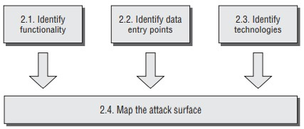

   - Identify Functionality
     - Xác định chức năng chính của web app và công việc mà mỗi chức năng thực hiện
     - Xác định cơ chế bảo mật chính mà ứng dụng sử dụng. Cụ thể là xác định cơ chế thực hiện authentication, session management và access control
     - Xác định các chức năng và hành vi ngoại vi, ví dụ như redirect, off-site links, error message, chức năng quản trị và chức năng ghi log
   - Identify Data Entry Points
     - Xác định các đầu vào có thể
     - Phân tích cơ chế vận chuyển và mã hóa dữ liệu
     - Xác định các kênh out-of-band
   - Identify the Technologies Used
     - Xác định các công nghệ sử dụng trên client-side
     - Xác định các công nghệ sử dụng trên server-side
     - Kiểm tra HTTP `Server` header
     - Sử dụng Httprint tool để fingerprint
     - Xác định tên các srcipt hay câu lệnh query sử dụng Google `inurl`
   - Map the Attack Surface
     - Cố gắng xác định chắc chắn cấu trúc và chức năng phía server-side của ứng dụng và các cơ chế mà nó sử dụng. Ví dụ chức năng liệt kê các đơn hàng của khách hàng sẽ tương tác với CSDL, ...
     - Với mỗi chức năng, xác định các dạng lỗ hổng phổ biến mà chúng có thể gặp phải,, Ví dụ chức năng upload file có thể chứa lỗ hổng Path Traversal, ...
     - Lập kế hoạch tấn công, ưu tiên chức năng có khả năng tồn tại lỗ hổng nghiêm trọng nhất

3. Test Client-Side Controls

   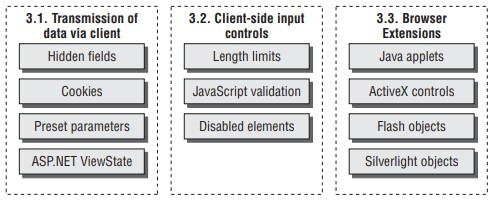

   - Test Transmission of Data Via the Client
     - Xác định vị trí các hidden form, cookie hay các tham số trong URL dùng để transmit dữ liệu từ client lên server
     - Xác định vai trò của 1 item trong logic của ứng dụng, dựa trên tên, giá trị và context mà chúng xuất hiện
     - Sửa giá trị của item liên quan đến vai trò của nó trong ứng dụng. Xác định xem việc thay đổi này có ảnh hưởng đến quá trình hoạt động của ứng dụng không và có thể bị khai thác không
     - Nếu dữ liệu truyền đi được làm nhiễu hoặc mã hóa thì có thể thử giải mã chúng theo nhiều cách, ví dụ như replay attack.
     - Nếu ứng dụng sử dụng ASP.NET `ViewState`, kiểm tra xem nó có thể bị giả mạo hoặc chứa các thông tin nhạy cảm hay không.
   - Test Client-Side Controls Over User Input
     - Kiểm tra xem client-side có thể kiểm soát các giá trị dùng để kiểm duyệt nội dung submit hay không (ví dụ như giới hạn độ dài hay kiểm tra = JavaScript). Nếu có thì có thể bypass dễ dàng
     - Lần lượt kiểm tra các trường input bằng cách gửi các nội dung bị block xem chúng có được gửi lên server hay không
     - Xác định xem cơ chế kiểm duyệt nào được sử dụng. Xác nhận xem ứng dụng có phụ thuộc hoàn toàn vào cơ chế kiểm soát client-side để đảm bảo an toàn hay không. Đồng thời xác nhận xem có tồn tại bất kì điều kiện nào có thể khai thác mà kích hoạt bởi input hay không
     - Kiểm tra toàn bộ HTML form để xác định các thuộc tính bị disabled, ví dụ `<input disabled=”true” name=”product”>`. Nếu tìm được thì thử submit chúng lên server để xem chúng có ảnh hưởng gì đến quá trình xử lý của server mà có thể lợi dụng để tấn công hay không.
   - Test Browser Extension Components
     - Understand the Client Application's Operation
     - Decompile the Client
     - Attach a Debugger
     - Test ActiveX controls

4. Test the Authentication Mechanism

   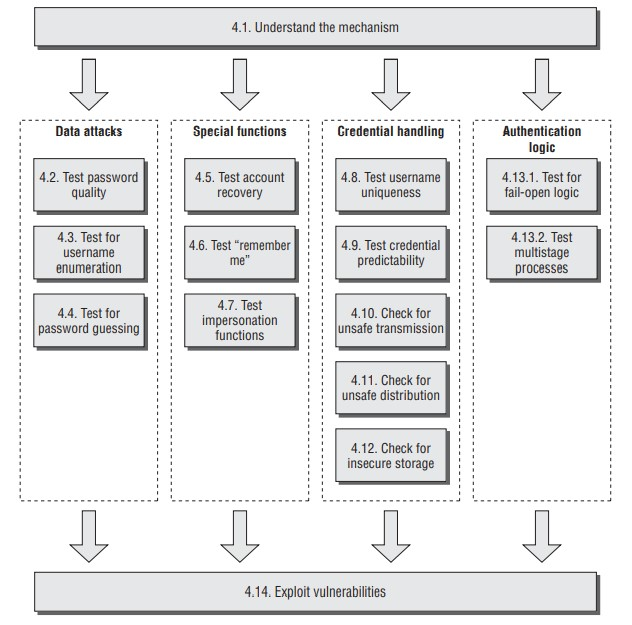

   - Understand the Mechanism
     - Thiết lập các công nghệ xác thực đang được sử dụng
     - Tìm tất các các chức năng liên quan đến xác thực (bao gồm đăng nhập, đăng kí, khôi phục tài khoản, ....)
   - Test Password Quality
     - Kiểm tra xem có quy tắc tối thiểu về mật khẩu hay không
     - Đặt thử nhiều loại mật khẩu yếu khác nhau thông qua các chức năng khác nhau xem ứng dụng có chấp nhận hay không
     - Thử submit credentials không hoàn chỉnh
   - Test for Username Enumeration
   - Test Resilience to Password Guessing
   - Test Any Account Recovery Function
   - Test Any Remember Me Function
   - Test Any Impersonation Function
   - Test Username Uniqueness
   - Test Predictability of Autogenerated Credentials
   - Check for Unsafe Transmission of Credentials
   - Check for Unsafe Distribution of Credentials
   - Test for Insecure Storage
   - Test for Logic Flaws
   - Exploit Any Vulnerabilities to Gain Unauthorized Access

5. Test the Session Management Mechanism

   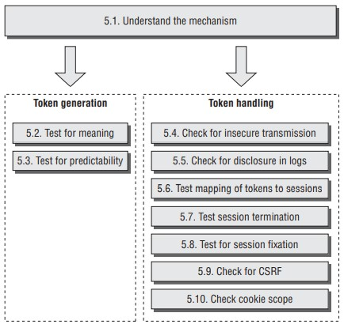

   - Understand the Mechanism
   - Test Tokens for Meaning
   - Test Tokens for Predictability
   - Check for Insecure Transmission of Tokens
   - Check for Disclosure of Tokens in Logs
   - Check Mapping of Tokens to Sessions
   - Test Session Termination
   - Check for Session Fixation
   - Check for CSRF
   - Check Cookie Scope

6. Test Access Controls

   

   - Understand the Access Control Requirements
   - Test with Multiple Accounts
   - Test with Limited Access
   - Test for Insecure Access Control Methods

7. Test for Input-Based Vulnerabilities

   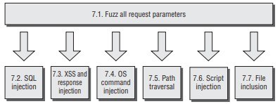

   - Fuzz All Request Parameters
   - Test for SQL Injection
   - Test for XSS and Other Response Injection
   - Test for OS Command Injection
   - Test for Path Traversal
   - Test for Script Injection
   - Test for File Inclusion

8. Test for Function-Specific Input Vulnerabilities

   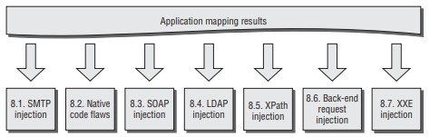

   - Test for SMTP Injection
   - Test for Native Software Vulnerabilities
   - Test for SOAP Injection
   - Test for LDAP Injection
   - Test for XPath Injection
   - Test for Back-End Request Injection
   - Test for XXE Injection

9. Test for Logic Flaws

   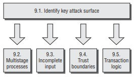

   - Identify the Key Attack Surface
   - Test Multistage Processes
   - Test Handling of Incomplete Input
   - Test Trust Boundaries
   - Test Transaction Logic

10. Test for Shared Hosting Vulnerabilities

    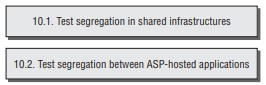

    - Test Segregation in Shared Infrastructures
    - Test Segregation Between ASP-Hosted Applications

11. Test for Application Server Vulnerabilities

    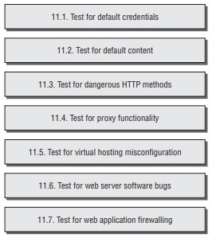

    - Test for Default Credentials
    - Test for Default Content
    - Test for Dangerous HTTP Methods
    - Test for Proxy Functionality
    - Test for Virtual Hosting Misconfiguration
    - Test for Web Server Software Bugs
    - Test for Web Application Firewalling

12. Miscellaneous Checks

    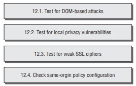

    - Check for DOM-Based Attacks
    - Check for Local Privacy Vulnerabilities
    - Check for Weak SSL Ciphers
    - Check Same-Origin Policy Configuration

13. Follow Up Any Information Leakage
