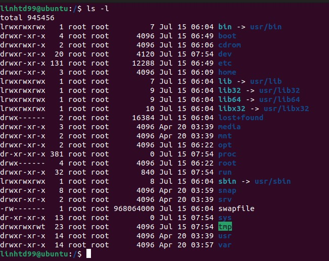

# Challenge 1: Bài tập shell script

## 1. Cài đặt OS, phần mềm (1đ)

### 1.1. Tìm hiểu hệ điều hành Ubuntu

1. Cấu trúc thư mục:

- /bin - Lưu trữ các tệp tin thực thi của người dùng, có thể lưu ở dạng mã nhị phân hoặc là .sh
- /sbin - Lưu trữ các tệp tin thực thi của hệ thống, thường chỉ được chạy bởi root hoặc superuser
- /boot - Lưu trữ các tệp tin cần thiết cho quá trình khởi động máy
- /dev - Lưu trữ thông tin về các thiết bị ngoại vi, trong này chứa 1 folder đặc biệt là dev/null, khi chuyển một thư mục/tệp tin vào dev/null có nghĩa là nó sẽ bị xóa đi nhưng vẫn được báo là ghi thành công
- /etc - Lưu trữ các tệp tin cài đặt hệ thống hoặc ứng dụng
- /home - Thư mục của người dùng
- /lib - Lưu trữ các thư viện của hệ thống. Thông thường khi cài đặt các gói tin sẽ bao gồm các thư viện cài đặt thêm để hỗ trợ. Khi đó hệ thống sẽ sắp xếp các thư viện này vào cùng 1 chỗ để dễ dàng hơn khi gọi ra
- /lost+found - Lưu trữ các tệp tin mà fsck (filesystem check) khôi phục lại
- /media - Chứa các thiết bị tháo lắp
- /mnt - Chứa các thư mục của các ổ cứng hay trong cùng 1 mạng
- /opt - Chứa các tệp tin không thuộc phạm vi xử lý của package manager
- /proc - Chứa các thông tin về tiến trình: Các thông tin về hệ thống được biểu diễn dưới dạng file
- /root - Thư mục của người dùng root
- /srv - Chứa dữ liệu về các dịch vụ hệ thống sử dụng
- /sys - Chứa thông tin liên quan đến hệ thống Linux
- /tmp - Chứa các tệp tin tạm
- /usr - Chứa các công cụ và ứng dụng của người dùng
- /var - Chứa dữ liệu thay đổi

2. Hệ thống file trên linux

- Hệ thống file Ext, Ext2, Ext3 và Ext4
  - Ext viết tắt của **Extended File System**, được phát triển chủ yếu cho MINIX OS, Ext là phiên bản đầu tiên và không được sử dụng nữa do giới hạn của nó
  - Ext2 cho phép quản lý 2TB dữ liệu
  - Ext3 là phiên bản nâng cấp của Ex2. Hạn chế của Ext3 là không hỗ trợ máy chủ vì Ext3 không hỗ trợ khôi phục tệp và disk snapshot
  - Ext4 là phiên bản mới nhất, mặc định trên các Linux Distro và là phiên bản nhanh nhất, tương thích vs SSD
- Hệ thống file JFS
  - JFS viết tắt của **Journaled File System**, được phát triển bởi IBM cho AIX UNIX. Đây là một hệ thống file thay thế cho Ext. Nó cũng có thể thay thế Ext4, nếu cần sự ổn định với ít tài nguyên. JFS là hệ thống file tiện dụng khi sức mạnh của CPU bị hạn chế
- Hệ thống file ReiserFS
  - Thay thế cho Ext3
  - Đã cải thiện hiệu suất và các tính năng nâng cao
  - Trước đây là hệ thống file mặc định trên SUSE Linux, nhưng sau khi thay đổi chính sách thì SUSE quay lại sử dụng Ext3
  - Hệ thống file này hỗ trợ động phần mở rộng nhưng có một số hạn chế về hiệu suất
- Hệ thống file XFS
  - XFS được goi là JFS tốc độ cao, được phát triển để xử lý song song I/O. NASA vẫn đang sử dụng hệ thống file này với máy chủ lưu trữ lớn (300+ TB)
- Hệ thống file Btrfs
  - Btrfs viết tắt của **B tree file system**. Được sử dụng để chịu lỗi, sửa chữa hệ thống, cấu hình lưu trữ mở rộng và hơn thế nữa.
- Hệ thống file Swap
  - Hệ thống file Swap được sử dụng để memory paging trong Linux trong quá trình hibernation. Một hệ thống không bao giờ trong trạng thái hibernation bắt buộc phải có Swap bằng với kích thước RAM.

### 1.2. Cài đặt Ubuntu

### 1.3. Cài đặt phần mềm

- Cài qua apt-get: `sudo apt-get install <package_name>`, ví dụ: `sudo apt-get install gobuster`

  

- Build từ source code: Sử dụng go lang để Build gobuster

  

- Chạy file deb: `sudo dpkg -i <path_to_deb>`, ví dụ `sudo dpkg -i viber.deb`

  

## 2. Tìm hiểu lệnh (2đ)

- Xem thông tin OS
  - Tên, phiên bản, kiến trúc: `uname -a`
  - Danh sách cá gói phần mềm đã được cài đặt: `apt list --installed`
- Xem cấu hình máy
  - CPU: `lscpu`
  - RAM: `lsmem`
  - Ổ cứng: `sudo fdisk -l` hoặc `lsblk`
- Xem thông tin về mạng
  - Địa chỉ IP, Gateway, DNS: `ifconfig` và `less /etc/resolv.conf`
  - Các kết nối đang mở và tiến trình tương ứng: `netstat`
- Quản lý tiến trình
  - Xem danh sách các tiến trình đang chạy: `ps -aux` hoặc `top`
  - Tắt tiến trình theo PID: `kill <PID>`
  - Tắt tiến trình theo tên: `killall <process_name>`
- Tìm kiếm file
  - Tìm theo tên (phân biệt/không phân biệt hoa thường): `find . -name <file_name>` / `find . -iname <file_name>`
  - Tìm theo owner/group: `find . -name <file_name> -user <user> -group <group>`
  - Tìm theo thời gian chỉnh sửa/truy cập cuối: `find . -name <file_name> -mtime <last_time_modified>`
  - Tìm theo dung lượng: `find . -name <file_name> -size <file_size>`
  - Tìm theo nội dung file: `find . -name <file_name> -print | xargs grep "<content>"`
- Đặt lịch chạy định kì
  - Để xem các tác vụ theo lịch trình sử dụng `crontab -l`
  - Để đặt lịch chạy định kì, mở file crontab bằng cách sử dụng tùy chọn -e: `crontab -e`
  - Sau đó thêm các mục, tuân thủ theo một cú pháp: `m h d mon dow command`
    - `m` = Phút (từ 0 đến 59)
    - `h` = Giờ (từ 0 đến 23)
    - `d` = Ngày trong tháng (từ 1 đến 31)
    - `mon` = Tháng (từ 1 đến 12)
    - `dow` = Ngày trong tuần (từ 0 đến 6 với 0 là Chủ Nhật)
    - `command` = Lệnh chạy
  - Chạy lệnh X định kì vào 0h00 mỗi ngày: `0 0 * * * /X`
  - Chạy lệnh Y định kì vào 8h00 từ thứ hai đến thứ sáu: `0 0 * * 1-5 /Y`
  - Chạy lệnh Z định kì mỗi 3 giờ một lần vào ngày 15 của tháng: `0 */8 15 * * /Z `
- Phân quyền
  - Tạo mới 3 user: UserA và UserB thuộc GroupX, UserC thuộc GroupY
    - UserA và UserB thuộc GroupX: `sudo useradd -m -g GroupX UserA` và `sudo useradd -m -g GroupX UserB`
    - UserC thuộc GroupY: `sudo useradd -m -g GroupY UserC`
  - Phân quyền file F1 chỉ cho phép thực thi bởi UserA/GroupX: 
    - 1.1. Chuyển chủ sở hữu F1 thành UserA: `sudo chown UserA F1`
    - 1.2. Chỉ cho phép UserA thực thi F1: `sudo chmod u+x F1`
    - 2.1. Chuyển chủ sở hữu F1 thành GroupX: `sudo chown :GroupX F1`
    - 2.2. Chỉ cho phép GroupX thực thi F1: `sudo chmod g+x F1`
  - Phân quyền thư mục D1 cho phép mọi user có quyền đọc file bên trong thư mục nhưng chỉ có UserA/GroupX được tạo file mới
    - 1.1. Chuyển chủ sở hữu D1 thành UserA: `sudo chown UserA /D1`
    - 1.2. Chỉ cho phép UserA tạo file mới: `sudo chmod u+w,o+r /D1`
    - 2.1. Chuyển chủ sở hữu D1 thành GroupX: `sudo chown :GroupX /D1`
    - 2.2. Chỉ cho phép GroupX tạo file mới: `sudo chmod g+w,o+r /D1`
  - Phân quyền thư mục D2 chỉ cho phép UserA/GroupX được xem danh sách file trong thư mục đó
    - 1.1. Chuyển chủ sở hữu D2 thành UserA: `sudo chown UserA /D2`
    - 1.2. Chỉ cho phép UserA xem danh sách file: `sudo chmod u+r /D2`
    - 2.1. Chuyển chủ sỡ hữu D2 thành GroupX: `sudo chown :GroupX /D2`
    - 2.2. Chỉ cho phép GroupX xem danh sách file: `sudo chmod g+r /D2`

## 3. Thực hành (7đ)

### 3.1. Lấy thông tin hệ thống (2đ)

### 3.2. Xử lý file (2đ)

### 3.3. Monitor SSH (2đ)

### 3.4. Cài đặt webserver (1đ)

1. Cài đặt apache2: `sudo apt install apache2`

2. Khởi động service apache2: `sudo service apache2 restart`

3. Tạo file helloworld.html: `sudo echo "<h1>Hello world, apache2</h1>" > /var/www/html/helloworld.html`

4. Dùng curl để kiểm tra file HTML vừa tạo: `curl http://localhost/helloworld.html`
   - Output: `<h1>Hello world, apache2</h1>`

### 3.5. Cấu hình virtual hosts cho webserver

1. Tạo thư mục lưu trữ web cho 2 website

   - Cho web1: `sudo mkdir -p /var/www/web1/public_html`
   - Cho web2: `sudo mkdir -p /var/www/web2/public_html`

2. Tạo file `index.html`

   - Cho web1: `sudo echo "<h1>Web1</h1>" > /var/www/web1/public_html/index.html`
   - Cho web2: `sudo echo "<h1>Web2</h1>" > /var/www/web2/public_html/index.html`

3. Sao chép 2 virtual host mặc định cho web1 và web2

   - Cho web1: `sudo cp /etc/apache2/sites-available/000-default.conf /etc/apache2/sites-available/web1.conf`
   - Cho web2: `sudo cp /etc/apache2/sites-available/000-default.conf /etc/apache2/sites-available/web2.conf`

4. Chỉnh sửa tệp tin cấu hình cho web1

	> `<VirtualHost:*80>`
	> 
	> 	`ServerName web1.com`
	> 	
	> 	`ServerAlias www.web1.com`
	> 	
	> 	`ServerAdmin webmaster@localhost`
	> 	
	> 	`DocumentRoot /var/www/web1/public_html`
	> 	
	> `</VirtualHost>`
	
5. Chỉnh sửa tệp tin cấu hình cho web2

   > `<VirtualHost:*80>`
   > 
   > 	`ServerName web2.com`
   > 	
   > 	`ServerAlias www.web2.com`
   > 	
   > 	`ServerAdmin webmaster@localhost`
   > 	
   > 	`DocumentRoot /var/www/web2/public_html`
   > 	
   > `</VirtualHost>`

6. Kích hoạt config của Apache Virtual Hosts

   > `sudo a2dissite 000-default.conf`
   > 
   > `sudo a2ensite web1.conf`
   > 
   > `sudo a2ensite web2.conf`
   
7. Sử dụng file /etc/hosts để tạo hai domain web1.com và web2.com

   - `sudo nano /etc/hosts`
   - Thêm vào 2 dòng: `127.0.0.1 web1.com` và `127.0.0.1 web2.com`

8. Kết quả

   

   

### 3.6. Cài đặt mysql, php, wordpress

1. Cài đặt mysql và php: `sudo apt install php libapache2-mod-php mysql-server php-mysql`

2. Tải về worpress: `wget http://wordpress.org/latest.tar.gz`

3. Giải nén wordpress: `tar -xzvf latest.tar.gz`

4. Copy wordpress đến thư mục của web1: `sudo cp -R wordpress/* /var/www/web1/public_html`

5. Tạo database cho Wordpress

   > `sudo mysql -u root`
   >
   > `mysql> CREATE DATABASE wordpress;`
   >
   > `mysql> GRANT SELECT,INSERT,UPDATE,DELETE,CREATE,DROP,ALTER`
   >     `-> ON wordpress.*`
   >     `-> TO 'wordpress'@'localhost'`
   >     `-> IDENTIFIED BY 'wordpress';`
   >
   > `mysql> FLUSH PRIVILEGES;`
   >
   > `mysql> quit`

6. Tạo file config cho Wordpress từ sample: `sudo cp /var/www/web1/public_html/wp-config-sample.php /var/www/web1/public_html/wp-config.php`

7. Mở file config lên và chỉnh sửa: `sudo nano /var/www/web1/public_html/wp-config.php`

   > `define('DB_NAME', 'wordpress');`
   > `define('DB_USER', 'wordpress');`
   > `define('DB_PASSWORD', 'wordpress');`
   > `define('DB_HOST', 'localhost');`
   > `define('DB_COLLATE', 'utf8_general_ci');`

8. Reload Apache2: `sudo systemctl reload apache2`

9. Kết quả

   

### 3.7. Lập trình trên linux

1. Lập trình và biên dịch chương trình C/C++

   - Tạo file `HelloWorld.c`: `nano HelloWorld.c `

   - Chỉnh sửa file `HelloWorld.c`:

     > `#include<stdio.h>`
     >
     > `int main(){`
     > 	`printf("Hello World");`
     > 	`return 0;`
     > `}`

   - Biên dịch: `gcc -o HelloWorld HelloWorld.c`

   - Chạy file HelloWord: `./HelloWorld`

2. Lập trình tìm kiếm nhị phân trên python

   - Tạo file: `nano binarySearch.py`

   - Chỉnh sửa file `binarySearch.py`:

     > `def binary_search(nums, target):`
     >
     >   `left, right = 0, len(nums) - 1` 
     >
     > ​    
     >
     >   `while left <= right:`
     >
     > ​    `middle = left + (right - left)//2`  
     >
     > ​    `if nums[middle] == target:`   
     >
     > ​      `return middle + 1`
     >
     > ​    `elif nums[middle] > target:`   
     >
     > ​      `right = middle - 1`
     >
     > ​    `else:`
     >
     > ​      `left = middle + 1`         
     >
     >   `return -1`            
     >
     > 
     >
     > `nums = list(map(int, input().split(" ")))`
     >
     > `target = int(input())`
     >
     > `nums.sort()`
     >
     > `print(binary_search(nums=nums,target=target))`

   - Biên dịch và chạy: `python3 binarySearch.py`

   - Kết quả:

     
