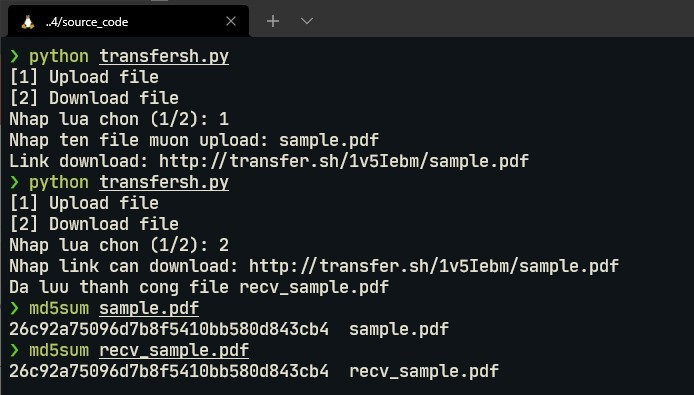

# Challenge 4: Lập trình mạng/HTTP Client

## 1. Lý thuyết

1. **Request-Line**: `Request-Line   = Method SP Request-URI SP HTTP-Version CRLF`
   - **Method**
     - Method xác định phương thức được thực hiện với tài nguyên
     - Method có thể là:
       - "OPTIONS"
       - "GET"
       - "HEAD"
       - "POST"
       - "PUT"
       - "DELETE"
       - "TRACE"
       - "CONNECT"
     - Danh sách các method có thể được xác định trong trường **Allow header**. Return code sẽ luôn thông báo cho client biết method nào được phép sử dụng. Ví dụ như `405 Method Not Allowed` có nghĩa là method này server biết nhưng không được phép sử dụng trên tài nguyên đó, hay `501 (Not Implemented)` có nghĩa là method này server không biết và không sử dụng.
   - **Request-URI**
     - URI viết tắt của Uniform Resource Identifier - xác định tài nguyên mà người dùng yêu cầu
     - `Request-URI    = "*" | absoluteURI | abs_path | authority`
       - Dấu `"*"` được sử dụng khi HTTP request không áp dụng tới tài nguyên cụ thể nào cả mà áp dụng cho bản thân server. Chỉ được phép sử dụng khi phương thức đó không nhất thiết phải áp dụng cho một tài nguyên. Ví dụ: `OPTIONS * HTTP/1.1`
       - `absoluteURI` được sử dụng khi HTTP request tới một proxy. Proxy này được yêu cầu chuyển tiếp request hoặc service từ cache và trả về response
       - `abs_path` được sử dụng để xác định tài nguyên trên server
       - `authority` chỉ sử dụng bởi methoe "CONNECT"
     - `URI = scheme:[//authority]path[?query][#fragment]`
   
2. **HTTP Header**

   - `Host`: Xác định host và port của cổng để request gửi tới

     ```http
     Host: <host>:<port>
     ```

   - `Location`: Xác định URL để chuyển hướng một trang tới. Chỉ có nghĩa nếu trả về code `3xx (redirection)` hoặc `201 (created)`

     ```http
     Location: <url>
     ```

   - `Cookie`: Chứa HTTP Cookie được gửi bởi server với header `Set-Cookie`

     ```http
     Cookie: <cookie-list>
     Cookie: name=value
     Cookie: name=value; name2=value2; name3=value3
     ```

   - `Referer`: Chứa địa chỉ của trang gửi request. Server có thể dựa vào `Referer` header để xác định người dùng tới từ trang nào, dùng để phân tích, logging, tối ưu hóa caching, ...

     ```http
     Referer: <url>
     ```

   - `Content-length`: Xác định kích cỡ body của thông điệp (bytes)

     ```http
     Content-Length: <length>
     ```

   - `Cache-Control`: Chứa các chỉ thị (instructions) cho caching trong cả request và response

     ```http
     # Cache request directive
     Cache-Control: max-age=<seconds>
     Cache-Control: max-stale[=<seconds>]
     Cache-Control: min-fresh=<seconds>
     Cache-Control: no-cache
     Cache-Control: no-store
     Cache-Control: no-transform
     Cache-Control: only-if-cached
     ```

     ```http
     # Cache response directive
     Cache-Control: must-revalidate
     Cache-Control: no-cache
     Cache-Control: no-store
     Cache-Control: no-transform
     Cache-Control: public
     Cache-Control: private
     Cache-Control: proxy-revalidate
     Cache-Control: max-age=<seconds>
     Cache-Control: s-maxage=<seconds>
     ```

   - `Connection`: Kiểm soát xem kết nối có giữ lại hoặc đóng sau khi giao dịch hiện tại kết thúc

     ```http
     Connection: keep-alive
     Connection: close
     ```

   - `Range`: Xác định phần document mà server trả về. Có thể xác định nhiều phần của document trong một `Range` header

     ```http
     Range: <unit>=<range-start>-
     Range: <unit>=<range-start>-<range-end>
     Range: <unit>=<range-start>-<range-end>, <range-start>-<range-end>
     Range: <unit>=<range-start>-<range-end>, <range-start>-<range-end>, <range-start>-<range-end>
     Range: <unit>=-<suffix-length>
     ```

   - `Strict-Transport-Security`: Để báo cho browser là chỉ nên truy cập sử dụng HTTPS thay cho HTTP

     ```http
     Strict-Transport-Security: max-age=<expire-time>
     Strict-Transport-Security: max-age=<expire-time>; includeSubDomains
     Strict-Transport-Security: max-age=<expire-time>; preload
     ```

   - `Access-Control-Allow-Origin`: Cho biết liệu response có thể được chia sẻ với request code từ cùng một nguồn cho trước hay không

     ```http
     Access-Control-Allow-Origin: *
     Access-Control-Allow-Origin: <origin>
     Access-Control-Allow-Origin: null
     ```

3. **CSP, Same Origin Policy, HTTP Only, Cookie Flag**

   - **CSP (Content Security Policy)** là một biện pháp bảo mật từ phía trình duyệt, giúp ngăn chặn những request xấu. **CSP** là tập hợp một danh sách an toàn (whitelist) những domain hay kiểu script, image, frame, ... Điều này đảm bảo chỉ có những script, image, style, ... được chỉ định mới có thể được tải

     ```
     Content-Security-Policy: <policy>
     ```

     - `script-src`: Chỉ định những nguồn được tải cho các tài nguyên JavaScript
     - `style-src`: Chỉ định những nguồn được tải cho các tài nguyên CSS
     - `connect-src`: Chỉ định những nguồn được tải cho các request Ajax, WebSocket
     - `img-src`: Chỉ định những nguồn được tải cho các tài nguyên là hình ảnh
     - `font-src`: Chỉ định những nguồn được tải cho các tài nguyên là webfont
     - `frame-src`: Chỉ định những nguồn được tải cho các tài nguyên là <iframe>
     - Các giá trị của CSP directive:
       - *: Giá trị wildcard, tương đương allow all
       - *self*: Là chính domain là người dùng đang truy cập
       - *none*: Không cho phép tải từ bất cứ nguồn nào, kể cả domain hiện tại
       - *data:* Cho phép những tài nguyên sử dụng data: được tải, ví dụ hình ảnh mã hóa base64
       - *www.domain.com*: Cho phép tải từ www.domain.com. Tuy nhiên, www.domain.com và domain.com là hoàn toàn khác nhau
       - *domain.com*: Cho phép tải từ domain.com. Tuy nhiên không cho phép tải từ www.domain.com, sub.domain.com, cdn.domain.com, ...
       - **.domain.com*: Cho phép tải từ domain.com, sub.domain.com, cdn.domain.com, ...
       - *https://domain.com*: Cho phép tải từ domain.com sử dụng HTTPS
       - *https:*: Cho phép tải từ nguồn sử dụng HTTPS
     
   - **SOP (Same Origin Policy)**: Là chính sách quy định nội dung từ một website chỉ được đọc và thay đổi bởi một thành phần khác cùng site đấy, trường hợp truy cập nằm ngoài phạm vi site sẽ bị chặn.

     - Nếu không có SOP, khi người dùng vô tình truy cập một trang web độc hại, script được đặt sẽn trên này có thể truy cập được dữ liệu và thực hiện tính năng của bất kì trang web nào người dùng đã dùng trước đó. Chẳng hạn như thực hiện chuyển tiền, đọc mail hay chụp ảnh thẻ tín dụng khi giao dịch trực tuyến. Ví lý do này, các trình duyệt bắt buộc phải áp dụng SOP để ngăn chặn tương tác giữa các domain khác nhau

   - **HTTP Only**: Bảo vệ cookie khỏi việc truy cập trái phép từ trình duyệt. Chỉ lưu và gửi kèm cookie phản hồi từ client tới server. Việc hạn chế từ trình duyệt giúp hạn chế rủi ro từ các cuộc tấn công đánh cắp cookie

   - **Cookie flag**:

     - `Expires=<data>`: Thời gian tồn tại tối đa của cookie dưới dạng ngày
     - `Max-Age=<number>`: Thời gian tồn tại tối đa của cookie dưới dạng giây
     - `Domain=<domain-value>`: Host mà cookie được gửi đến
     - `Path=<path-value>`: Đường dẫn trong request URL
     - `Secure`: Sử dụng nếu muốn cookie được gửi bằng HTTPS
     - `HttpOnly`: Cấm JavaScript truy cập cookie thông qua tính năng `Document.cookie`
     - `SameSite=<samesite-value>`: Kiểm soát xem cookie có được gửi cùng với các cross-origin request hay không, có thể giúp bảo vệ trước kĩ thuật tấn công CSRF

4. **HTTP Response Code**

   |               CODE                | Ý NGHĨA                                                      |
   | :-------------------------------: | ------------------------------------------------------------ |
   |           100 Continue            | Phản hồi tạm thời này cho biết rằng mọi thứ tới hiện tại vẫn ổn và phía client nên tiếp tục yêu cầu hay bỏ qua phản hồi nếu yêu cầu đã hoàn tất. |
   |      101 Switching Protocol       | Code này được gửi để phản hồi header yêu cầu Upgrade từ phía client và cho biết giao thức máy chủ đang chuyển sang. |
   |      102 Processing (WebDAV)      | Code này cho biết rằng máy chủ đã nhận và đang xử lý yêu cầu, nhưng phản hồi vẫn chưa có hiệu lực. |
   |          103 Early Hints          | Được sử dụng để trả về một số tiêu đề phản hồi trước message HTTP cuối cùng. |
   |              200 OK               | Yêu cầu đã thành công.                                       |
   |            201 Created            | Yêu cầu đã thành công và kết quả là một tài nguyên mới đã được tạo. Đây thường là phản hồi được gửi sau các yêu cầu POST hoặc một số yêu cầu PUT. |
   |           202 Accepted            | Yêu cầu đã được nhận nhưng chưa được thực hiện. Yêu cầu này là non-committal, vì không có cách nào trong HTTP để gửi sau đó một phản hồi không đồng bộ cho biết kết quả của yêu cầu. Nó dành cho các trường hợp trong đó 1 quá trình / máy chủ khác xử lý yêu cầu hoặc để xử lý hàng loạt. |
   | 203 Non-Authoritative Information | Code phản hồi này có nghĩa là siêu thông tin được trả về không hoàn toàn giống với thông tin có sẵn từ máy chủ gốc, nhưng được thu thập từ phần copy local hay của bên phía thứ 3. Code này chủ yếu được sử dụng để phản chiếu hoặc sao lưu tài nguyên khác. Ngoại trừ trường hợp cụ thể đó, thông thường phản hồi “200 OK” được ưu tiên cho trạng thái này. |
   |          204 No Content           | Không có nội dung để gửi cho yêu cầu này, nhưng các header có thể hữu dụng. User-agent có thể cập nhật các header đã lưu trong bộ nhớ cache cho tài nguyên này bằng các header mới. |
   |         205 Reset Content         | Cho user-agent biết để reset document đã gửi yêu cầu này.    |
   |        206 Partial Content        | Code phản hồi này được dùng khi Range header được gửi từ client để yêu cầu chỉ 1 phần của nguồn tài nguyên. |
   |     207 Multi-Status (WebDAV)     | Truyền tải thông tin về nhiều nguồn tài nguyên, đối với các trường hợp mà nhiều status code có thể đều thích hợp. |
   |   208 Already Reported (WebDAV)   | Được sử dụng trong 1 phần từ phản hồi <dav:propstat> để tránh liệt kê nhiều lần các thành viên nội tại của nhiều liên kết vào cùng một tập hợp |
   | 226 IM Used (HTTP Delta encoding) | Máy chủ đã hoàn thành yêu cầu GET cho nguồn tài nguyên và phản hồi là sự trình bày kết quả của 1 hoặc nhiều thao tác instance được áp dụng cho instance hiện tại. |
   |        300 Multiple Choice        | Yêu cầu có thể có nhiều hơn 1 phản hồi khả dụng. User-agent hay user nên chọn 1 trong số đó. (Không có cách chuẩn hóa nào để chọn 1 trong các phản hồi, nhưng HTML liên kết đến các khả năng được khuyến nghị để user có thể chọn.) |
   |       301 Moved Permanently       | URL của tài nguyên được yêu cầu đã được thay đổi vĩnh viễn. URL mới được đưa ra trong phần phản hồi. |
   |             302 Found             | Code phản hồi này có nghĩa là URI của tài nguyên được yêu cầu đã được thay đổi tạm thời. Những thay đổi khác trong URI có thể được thực hiện trong tương lai. Do đó, chính URI này sẽ được client sử dụng trong các yêu cầu trong tương lai. |
   |           303 See Other           | Máy chủ gửi phản hồi này để điều hướng client lấy nguồn tài nguyên tại 1 URI khác với 1 yêu cầu GET. |
   |         304 Not Modified          | Code này được sử dụng cho mục đích caching. Nó cho client biết rằng phản hồi chưa được điều chỉnh, nên client có thể tiếp tục sử dụng cùng phiên bản phản hồi trong bộ nhớ cache. |
   |           305 Use Proxy           | Được xác định trong phiên bản trước của HTTP specification để chỉ ra rằng phản hồi được yêu cầu phải được truy cập bằng proxy. Nó được yêu cầu do quan ngại về phần bảo mật liên quan đến cấu hình trong băng tần của proxy. |
   |            306 unused             | Mã phản hồi này không còn được sử dụng nữa, nó được bảo lưu và chỉ được sử dụng trong phiên bản trước của HTTP/1.1 specification. |
   |      307 Temporary Redirect       | Máy chủ gửi phản hồi này để điều hướng client tới lấy tài nguyên được yêu cầu tại 1 URI khác với cùng 1 phương thức đã được sử dụng trong yêu cầu trước đó. Code này có cùng ý nghĩa như code phản hồi HTTP 302 Found, ngoại trừ việc user-agent không được thay đổi phương thức HTTP sử dụng: nếu POST được dùng trong yêu cầu đầu tiên, POST phải được sử dụng trong yêu cầu thứ hai. |
   |      308 Permanent Redirect       | Điều này có nghĩa là tài nguyên hiện được đặt cố định tại 1 URI khác, được chỉ định bởi header Location: HTTP Response. Code này có cùng ý nghĩa như code phản hồi HTTP 301 Moved Permanently, ngoại trừ việc user-agent không được thay đổi phương thức HTTP sử dụng: nếu POST được dùng trong yêu cầu đầu tiên, POST phải được sử dụng trong yêu cầu thứ hai. |
   |          400 Bad Request          | Máy chủ không thể hiểu yêu cầu do cú pháp không hợp lệ.      |
   |         401 Unauthorized          | Cho dù quy chuẩn HTTP chỉ định “unauthorized” (không có thẩm quyền), nhưng nó có nghĩa phản hồi này là “unauthenticated” (chưa được xác thực). Có nghĩa là, client phải các tự xác thực chính mình để nhận được phản hồi đã yêu cầu. |
   |       402 Payment Required        | Code phản hồi này được dành cho những lần sử dụng trong tương lai. Mục đích ban đầu của việc tạo mã này là sử dụng nó cho các hệ thống thanh toán kỹ thuật số, tuy nhiên status code này rất hiếm khi được sử dụng và không tồn tại quy ước tiêu chuẩn nào. |
   |           403 Forbidden           | Client không có quyền truy cập vào phần nội dung, nghĩa là nó không được phép, vì vậy máy chủ từ chối cung cấp tài nguyên được yêu cầu. Không giống như 401, danh tính của client đã được máy chủ nhận biết. |
   |           404 Not Found           | Các tài nguyên hiện tại không được tìm thấy nhưng có thể có trong tương lai. Các request tiếp theo của Client được chấp nhận. |
   |      405 Method Not Allowed       | Phương thức yêu cầu được máy chủ nhận biết nhưng đã bị vô hiệu hóa và không thể sử dụng được. Ví dụ: 1 API có thể cấm XÓA 1 nguồn tài nguyên. 2 phương thức bắt buộc, GET và HEAD, không bao giờ được vô hiệu hóa và không được trả về code lỗi này. |
   |        406 Not Acceptable         | Phản hồi này được gửi khi máy chủ web, sau khi thực hiện server-driven content negotiation, không tìm thấy bất kỳ nội dung nào phù hợp với các tiêu chí do user-agent đưa ra. |
   | 407 Proxy Authentication Required | Code này tương tự như 401 nhưng việc xác thực là cần thiết để được thực hiện bởi proxy. |
   |        408 Request Timeout        | Request tốn thời gian dài hơn thời gian Server được chuẩn bị để đợi. |
   |           409 Conflict            | Request không thể được hoàn thành bởi vì sự xung đột, ví dụ như là xung đột giữa nhiều chỉnh sửa đồng thời. |
   |             410 Gone              | Các resource được yêu cầu không còn nữa và sẽ không có sẵn một lần nữa, khi gặp mã lỗi này Client không nên có gắng tìm kiếm các tài nguyên này ở những lần sau. |
   |        411 Length Required        | Content-Length không được xác định rõ. Server sẽ không chấp nhận Request nào không có nó. |
   |      412 Precondition Failed      | Server sẽ không đáp ứng một trong những điều kiện tiên quyết của Client trong Request. |
   |       413 Payload Too Large       | Server sẽ không chấp nhận yêu cầu, bởi vì đối tượng yêu cầu là quá lớnớc đây nó gọi là "Request Entity Too Large". |
   |         414 URI Too Long          | RI được cung cấp là quá dài để Server xử lý, thường là kết quả của quá nhiều dữ liệu được mã hóa như là một truy vấn chuỗi của một GET Request, trong trường hợp đó nó phải được chuyển đổi sang một POST Request. Trước đây được gọi là "Request-URI Too Long" |
   |    415 Unsupported Media Type     | Server sẽ không chấp nhận Request, bởi vì kiểu phương tiện không được hỗ trợ. Ví dụ khi Client upload một ảnh có định dạng image/svg+xml, nhưng server yêu cầu một định dạng khác. |
   |     416 Range Not Satisfiable     | Client yêu cầu một phần của tập tin nhưng server không thể cung cấp nó. Trước đây được gọi là "Requested Range Not Satisfiable" |
   |      417 Expectation Failed       | Máy chủ không thể đáp ứng các yêu cầu của trường Expect trong header. |
   |     500 Internal Server Error     | Một thông báo chung chung, được đưa ra khi Server gặp phải một trường hợp bất ngờ, Message cụ thể là không phù hợp. |
   |        501 Not Implemented        | Server không công nhận các Request method hoặc không có khả năng xử lý nó. |
   |          502 Bad Gateway          | Server đã hoạt động như một gateway hoặc proxy và nhận được một Response không hợp lệ từ máy chủ nguồn. |
   |      503 Service Unavailable      | Server hiện tại không có sẵn.                                |
   |        504 Gateway Timeout        | Server đã hoạt động như một gateway hoặc proxy và không nhận được một Response từ máy chủ nguồn. |
   |  505 HTTP Version Not Supported   | Server không hỗ trợ phiên bản “giao thức HTTP”.              |

## 2. Bài tập thực hành

Mô tả: Viết HTTP Client GET, POST, Download, Uplaod lên trang web: https://transfer.sh/ bằng raw socket (không sử dụng thư viện http có sẵn)

Source code:

```python
import socket
import os

def upload_file(filename, s):
    try:
        header = f"PUT /{filename} HTTP/1.1\r\nHost: transfer.sh\r\nConnection: close\r\n"
        contentLength = "Content-Length: " + str(os.path.getsize(filename)) + "\r\n\r\n"
        f = open(filename, 'rb')
        request = bytes(header + contentLength, 'utf-8') + f.read() + b'\r\n'
        s.send(request)
        print("Link download: " + s.recv(8192).decode('utf-8').split("\n")[-1])

    except Exception:
        print("File co the khong ton tai!")

def download_file(link, s):
    try:
        item = link.split("transfer.sh")[1]
        filename = "recv_" + link.split("/")[4]
        request = (
            f"GET {item} HTTP/1.1\r\nHost: transfer.sh\r\nAccept: */*\r\nConnection: close\r\n\r\n")
        s.send(bytes(request, 'utf-8'))
        
        res = b''
        while True:
            data = s.recv(8192)
            if not data:
                break
            #print(data)
            res += data
        
        body = res.split(b"\r\n\r\n")[1]
        #print(body)
        f = open(filename, 'wb')
        f.write(body)
        f.close()
        print("Da luu thanh cong file " + filename)
        
    except Exception:
            print("Link co the khong dung!")
            
       
def main():
    s = socket.socket(socket.AF_INET, socket.SOCK_STREAM)
    ipaddr = socket.gethostbyname('transfer.sh')
    s.connect((ipaddr, 80))
    s.settimeout(5)

    print("[1] Upload file")
    print("[2] Download file")
    choice = input("Nhap lua chon (1/2): ")

    if choice == '1':
        filename = input("Nhap ten file muon upload: ")
        upload_file(filename, s)
    elif choice == '2':
        link = input("Nhap link can download: ")
        download_file(link.strip(" ").strip("\n"),s)

main()
```

Demo



