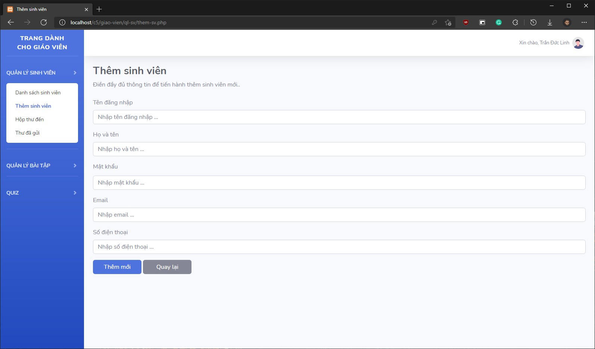
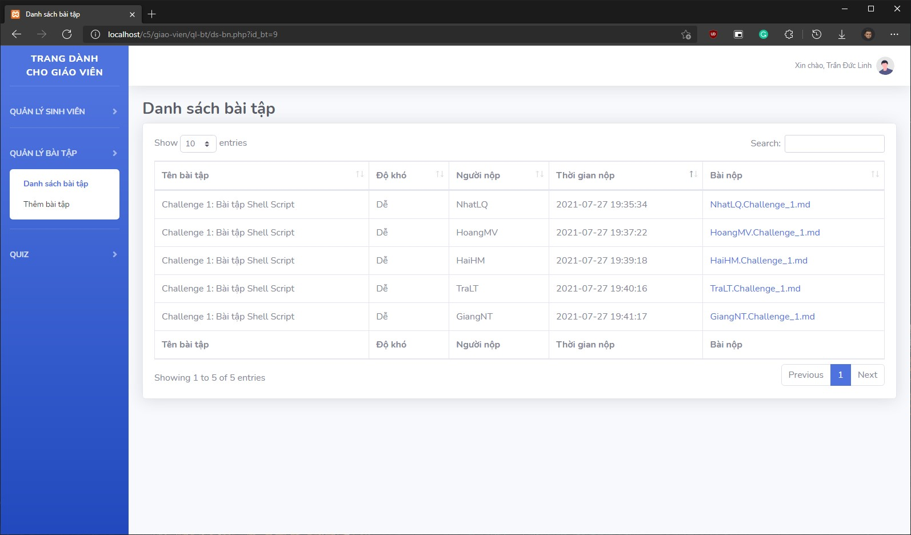

# Challenge 5: Lập trình WEB cơ bản

## 1. Đăng nhập

## 2. Giáo viên

### 2.1. Trang chủ

### 2.2. Danh sách sinh viên

### 2.3. Gửi tin nhắn

### 2.4. Sửa thông tin sinh viên

### 2.5. Thêm sinh viên

### 2.6. Hộp thư đến

### 2.7. Thư đã gửi

### 2.8. Sửa tin nhắn

### 2.9. Danh sách bài tập

### 2.10. Danh sách bài nộp

### 2.11. Thêm bài tập

### 2.12. Danh sách quiz

### 2.13. Thêm quiz

## 3. Sinh viên

### 3.1. Trang chủ

### 3.2. Sửa thông tin cá nhân

### 3.3. Danh sách sinh viên

### 3.4. Thông tin chi tiết sinh viên

### 3.5. Hộp thư đến

### 3.6. Thư đã gửi

### 3.7. Danh sách bài tập

### 3.8. Nộp bài tập

### 3.9. Lịch sử nộp bài

### 3.10. Danh sách quiz

### 3.11. Trả lời quiz

### 3.12. Đáp án quiz

